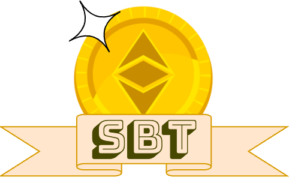
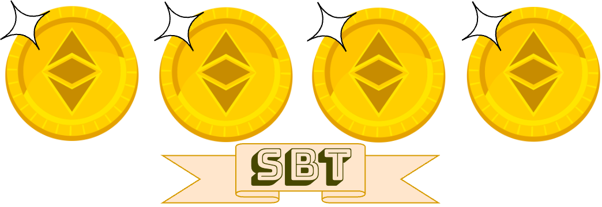
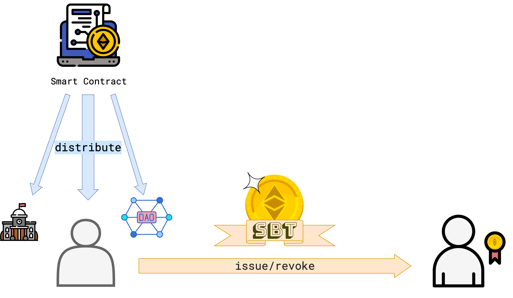

<p align="center">

</p>

<h1 align="center">FungibleSBT</h1>
<h4 align="center">A Prototype for a Fungible, Soulbound, and Revocable Token</h4>


Soulbound Tokens (SBTs) were proposed by Ethereum's founder Vitalik Buterin to provide a means for applications such as degrees, lending or reputation. In contrast to more commonly used types of tokens SBTs can only be issued to an account once and can not be transferred further to any other address. This entails that the token can not be sold or exchanged for other currencies.

Among possible use cases might be things such as loyalty points, renting contracts, awards, credit reports attendence certifications or reputation scores. While many of these can be imagined as unique non-fungible artifacts (NFTs) others - like reputation score or loyalty points - are rather fungible tokens in the sense of the [ERC20 standard](https://eips.ethereum.org/EIPS/eip-20).

This repository implements a soulbound _fungible_ token standard. Furthermore, it proposes an extension of the token which makes it depositable as a collateral. For example in the case of reputation so that the activities which increase reputation can also potentially lead to a loss of reputation. Or so that loyalty points can be burned in exchange for rewards.

### What are the properties of the Fungible Soulbound Token?
1. __Nontransferability__ - The token can not be transferred to another account or exchanged.
<p align="center">

</p>

2. __Revocability__ -  The token can be burned by the entity which issued it.
<p align="center">

</p>

3. __Fungibility__ - The individual unitary valued tokens are indistinguishable from each other.
<p align="center">

</p>


Since the standard template of fungible tokens is the ERC20 contract I  adapt it from the reference implementation of the IERC20 interface in the Openzeppelin contract library. The interface defines the blueprint for a token with the getter functions ``balanceOf()`` and ``totalSupply()`` which is also implemented in the FungibleSBT contract. Different from the ERC20 contract there are two separate balances - the balance of unassigned tokens which were not yet issued but only distributed or minted and the balance of issued tokens. This mechanism allows to mint the tokens to an account first without directly issuing them and rendering them unspendable. The first and only transfer called issuance is thereby decoupled from the minting process which makes it possible to control the supply of tokens independently of the issue mechanism. For example one might define a constant fixed supply distributed to a predefined list of recipients such as institutions, DAOs or ordinary accounts. Alternatively, the token can also be distributed as a mining reward.

<p align="center">

</p>

Compile
---
Install truffle and openzeppelin contracts
```
npm install --production
```

compile using the command:
```
npm run compile
``` 

Test
---

Install truffle, openzeppelin and ganache
```
npm install
```

To run Ganache from the console use

```
ganache
```

This should create an RPC server on 127.0.0.1:8545 and allow you to run the test suite


Then, to run the test suite use this command:

```
npm run test
```
 
License
---
This work is published under MIT License.

Copyright (C) 2023 by Christof Bless

Email: christofbless@gmail.com
