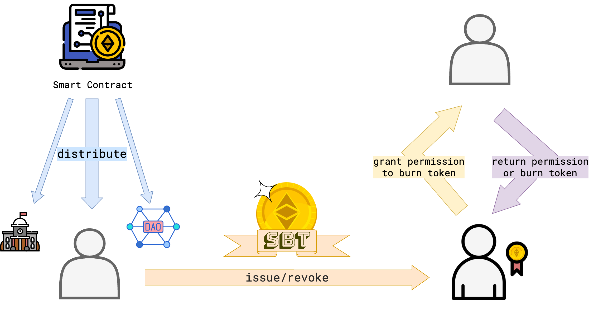

<p align="center">

</p>

# FungibleSBT, A prototype for a soulbound, interchangeable and revocable token

Soulbound Tokens (SBTs) were proposed by Ethereum's founder Vitalik Buterin to provide a means for applications such as degrees, lending or reputation. In contrast to more commonly used types of tokens SBTs can only be issued to an account once and can not be transferred further to any other address. This entails that the token can not be sold or exchanged for other currencies.

Among possible use cases might be things such as loyalty points, renting contracts, awards, credit reports attendence certifications or reputation scores. While many of these can be imagined as unique non-fungible artifacts (NFTs) others - like reputation score or loyalty points - are rather fungible tokens in the sense of the [ERC20 standard](https://eips.ethereum.org/EIPS/eip-20).

This repository implements a soulbound _fungible_ token standard. Furthermore, it proposes an extension of the token which makes it depositable as a collateral. For example in the case of reputation so that the activities which increase reputation can also potentially lead to a loss of reputation. Or so that loyalty points can be burned in exchange for rewards.

<p align="center">

</p>

Compile
---
Install truffle and openzeppelin contracts
```
npm install -g truffle
npm install @openzeppelin/contracts
```

compile using the command:
```
npm run compile
``` 

Test
---

Install truffle, openzeppelin and ganache
```
npm install -g truffle
npm install @openzeppelin/contracts
npm install -g ganache
```

To run Ganache from the console use

```
ganache
```

This should create an RPC server on 127.0.0.1:8545 and allow you to run the test suite


Then, to run the test suite use this command:

```
npm run test
```

